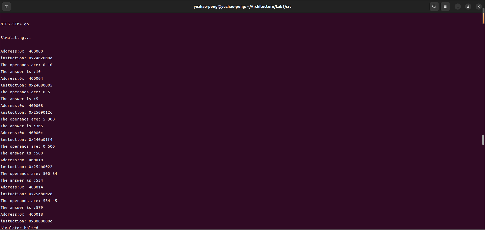
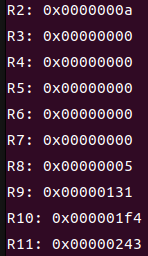
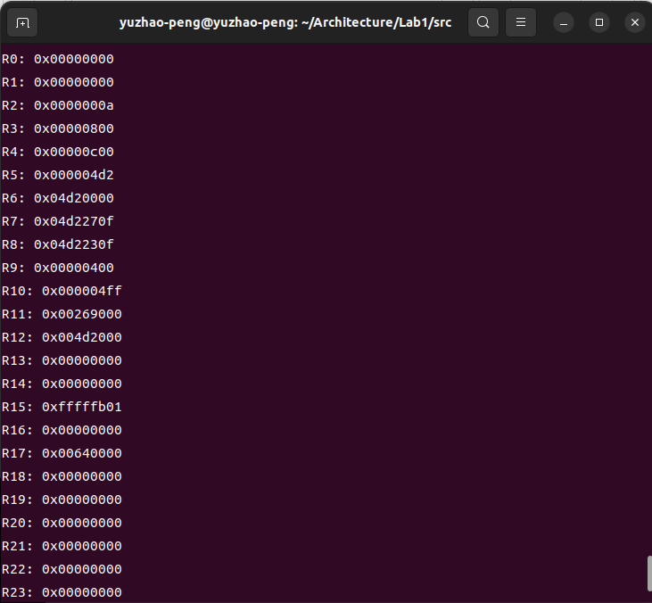
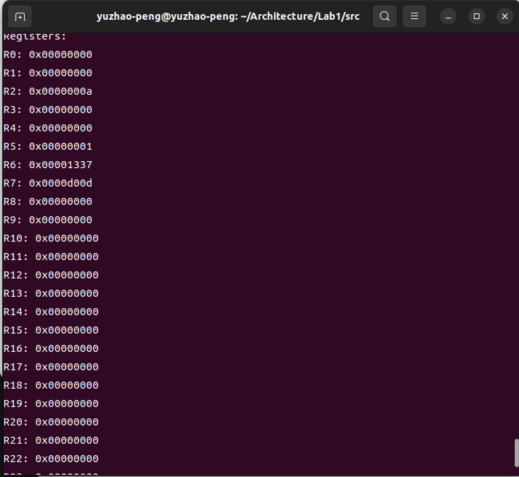
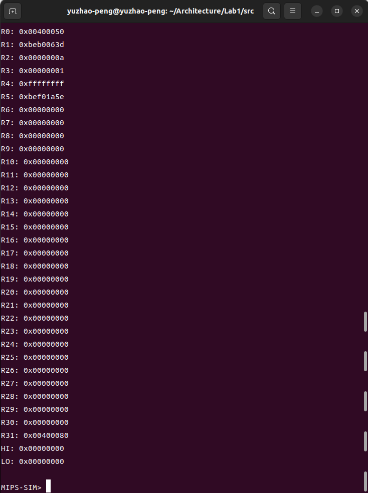
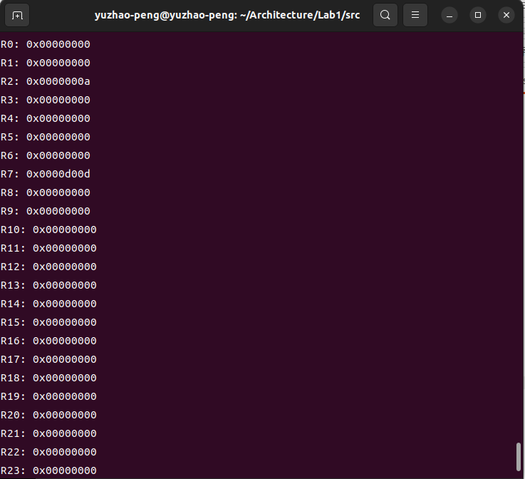
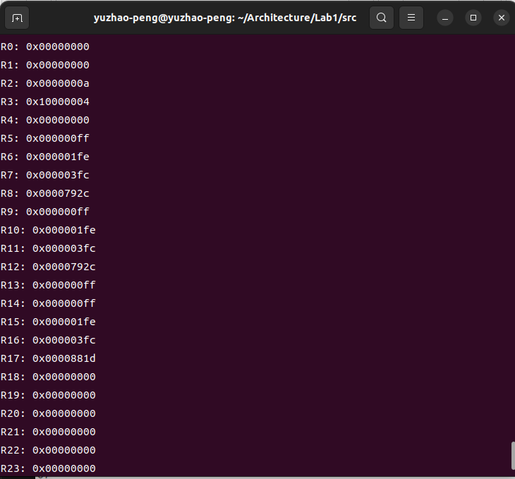
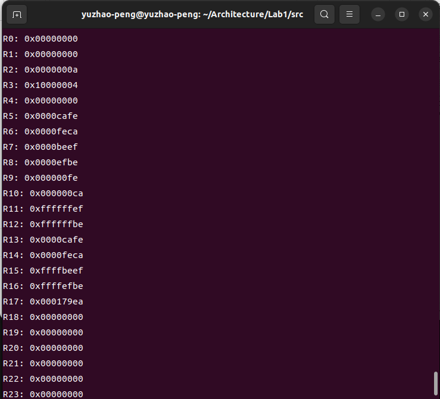

# MIPS模拟仿真实验

<center><strong>彭钰钊&nbsp;&nbsp;&nbsp;&nbsp;&nbsp;2110756</strong></center>

## 〇、前言

在本次实验中我们将通过编写一个C语言程序实现 MIPS 指令集有限子集的指令级功能模拟器，用于模拟每条指令的行为。这个模拟器能够运行 MIPS 程序并输出结果，在后续实验中将以此为参考，验证后续实验代码是否正确执行。

**实验流程：**

- 修改脚本，将`/inputs`文件夹下的 MIPS 汇编指令（.s文件）转换为机器指令存入.x文件
- 实现`/src/sim.c`中的`process_instruction()`函数
- 通过`make`得到可执行文件`sim`，测试功能

**实现指令：**

| J      | JAL    | BEQ  | BNE   | BLEZ    | BGTZ |
| ------ | ------ | ---- | ----- | ------- | ---- |
| ADDI   | ADDIU  | SLTI | SLTIU | ANDI    | ORI  |
| XORI   | LUI    | LB   | LH    | LW      | LBU  |
| LHU    | SB     | SH   | SW    | BLTZ    | BGEZ |
| BLTZAL | BGEZAL | SLL  | SRL   | SRA     | SLLV |
| SRLV   | SRAV   | JR   | JALR  | ADD     | ADDU |
| SUB    | SUBU   | AND  | OR    | XOR     | NOR  |
| SLT    | SLTU   | MULT | MFHI  | MFLO    | MTHI |
| MTLO   | MULTU  | DIV  | DIVU  | SYSCALL |      |

## 一、输入文件处理

实验的第一步我们需要将输入文件进行处理，把 MIPS 汇编代码（.s文件）处理为机器代码文件（.x文件），这一步利用脚本asm2hex完成，打开`/inputs`中的脚本文件我们发现需要配置spim工具，于是根据提供的链接[SPIM MIPS Simulator (wisc.edu)](https://pages.cs.wisc.edu/~larus/spim.html#installing)我们下载了最新的qtspim，在经过一番尝试后发现qtspim是一个可视化界面它可以将汇编代码的机器码在图形化界面展示出来并由相应的保存方式，但我们仍然希望使用脚本在命令行中直接执行得到.x文件。于是在查阅相关资料之后在[这里](https://sourceforge.net/p/spimsimulator/code/HEAD/tree/)发现了r764的spim文件夹，于是将这个链接中的文件打包下载，在`/spimsimulator-code-r764/spim`中打开终端输入`make`可以得到spim可执行文件。

编写`my_asm2hex`脚本实现输入文件的处理，在经过一番尝试后我们成功实现了addiu.s、arithtest.s、memtest0.s三个文件的正常转换，但是剩下的文件在处理时出现了意外的情况，虽然生成了相应的.x文件，但是却告诉我们它们之中存在溢出的立即数（实际上或许应该是伪指令）。为了解决这个问题我选择加入新的方式，以addiu文件为例如下：

```shell
mips-linux-gnu-as -march=mips32 -o addiu.o addiu.s
mips-linux-gnu-objcopy -O binary -j .text addiu.o addiu.bin
xxd -p -c 4 addiu.bin > addiu.x
```

并且将它也编写入脚本文件当中，看起来我解决了问题，当我执行到brtest1文件时梦想破灭，并且我们去看用第二种方式得到的.x文件与可视化界面中的机器代码并不相同，在经过一番权衡和考虑之后最终还是使用了最初的脚本，如下所示：

```python
#!/usr/bin/python3

import os
import argparse
import subprocess

# parse arguments
parser = argparse.ArgumentParser()
parser.add_argument("fasm", metavar="input.s", help="the MIPS assembly file (ASCII)")
args = parser.parse_args()

fasm = args.fasm
fhex = os.path.splitext(args.fasm)[0] + ".x"  # 构建输出文件路径

# 提供QtSPIM的可执行文件路径
SPIM = "/home/yuzhao-peng/Architecture/tools/spimsimulator-code-r764/spim/spim"

cmd = [SPIM, "-notrap", "-file", fasm, "-dump", "text.asm"]
subprocess.call(cmd)

# 从文本文件中提取并保存机器代码
with open("text.asm", "r") as asm_file:
    lines = asm_file.readlines()
    hex_data = []
    for line in lines:
        parts = line.split()
        if len(parts) >= 2 and parts[1].startswith("0x"):
            hex_data.append(parts[1][2:])

# 将提取的数据保存到 fhex 文件中
with open(fhex, "w") as hex_file:
    hex_file.write("\n".join(hex_data))

# 删除临时生成的文件
os.remove("text.asm")
os.remove("data.asm")

#我们利用python语言的特性按行遍历读取文本，通过`if len(parts) >= 2 and parts[1].startswith("0x")`筛选出机器代码并存入列表，最终将列表转存为.x文件，然后删除多余的无用文件。
```

接下来我们只需要在`/inputs`中打开终端并输入`./my_asm2hex *.s`便可以得到相应的.x文件了。

## 二、主体函数实现

这一步是我们实验的核心，我们将在`sim.c`中实现`process_instruction()` 函数，下面让我们分析一下我们所要实现的 MIPS 指令集子集。

### （一）指令分析

#### 1.R-type

R型指令用于寄存器之间的操作，通常用于算术和逻辑运算，其格式为`opcode | rs | rt | rd | shamt | funct`

| 字段     | opcode | rs    | rt    | rd    | shamt | funct |
| -------- | ------ | ----- | ----- | ----- | ----- | ----- |
| 位数范围 | 31-26  | 25-21 | 20-16 | 15-11 | 10-6  | 5-0   |

- `opcode`：操作码字段，为000000。
- `rs`、`rt`、`rd`：寄存器操作数的源寄存器和目标寄存器。`rs`和`rt`包含源操作数，`rd`用于存储结果。
- `shamt`：移位量字段，用于指定位移操作的位数。
- `funct`：功能字段，用于区分具体的操作（例如，ADD、SUB等）。

包括以下指令：

1. **位操作指令**

   - `SLL`	**（Shift Left Logical）**：

     SLL指令用于将寄存器中的值左移指定的位数，并将结果存储在目标寄存器中。

   - `SRL`	**（Shift Right Logical）**：

     SRL指令用于将寄存器中的值右移指定的位数，并在左侧填充零位，然后将结果存储在目标寄存器中。

   - `SRA`	**（Shift Right Arithmetic）**：

     SRA指令用于将寄存器中的值右移指定的位数，但在左侧使用符号位进行填充，然后将结果存储在目标寄存器中。

   - `SLLV`	**（Shift Left Logical Variable）**：

     SLLV指令根据源寄存器中的值，将目标寄存器中的值左移，并将结果存储在目标寄存器中。

   - `SRLV`	**（Shift Right Logical Variable）**：

     SRLV指令根据源寄存器中的值，将目标寄存器中的值右移，并在左侧填充零位，然后将结果存储在目标寄存器中。

   - `SRAV`	**（Shift Right Arithmetic Variable）**：

     SRAV指令根据源寄存器中的值，将目标寄存器中的值右移，但在左侧使用符号位进行填充，然后将结果存储在目标寄存器中。

2. **跳转指令**

   - `JR`	**（Jump Register）**：

     JR指令用于无条件跳转到存储在寄存器中的地址。它将程序计数器（PC）设置为目标寄存器中的值。

   - `JALR`	**（Jump and Link Register）**：

     JALR指令用于跳转到存储在寄存器中的地址，并将返回地址存储在寄存器中以供后续使用。

3. **移动指令**

   - `MFHI`	**（Move From HI）**

     MFHI指令用于将HI寄存器中的值移动到目标寄存器中。

   - `MTHI`	**（Move To HI）**：

     MTHI指令用于将源寄存器中的值移动到HI寄存器中。

   - `MFLO`	**（Move From LO）**：

     MFLO指令用于将LO寄存器中的值移动到目标寄存器中。

   - `MTLO`	**（Move To LO）**：

     MTLO指令用于将源寄存器中的值移动到LO寄存器中。

4. **运算指令**

   - `MULT`	**（Multiply）**：

     MULT指令用于执行有符号整数的乘法操作，并将结果存储在HI和LO寄存器中。

   - `MULTU`	**（Multiply Unsigned）**：

     MULTU指令用于执行无符号整数的乘法操作，并将结果存储在HI和LO寄存器中。

   - `DIV`	**（Divide）**：

     DIV指令用于执行有符号整数的除法操作，并将商存储在LO寄存器中，余数存储在HI寄存器中。

   - `DIVU`	**（Divide Unsigned）**：
     DIVU指令用于执行无符号整数的除法操作，并将商存储在LO寄存器中，余数存储在HI寄存器中。

   - `ADD`	**（Add）**：

     ADD指令用于将两个寄存器中的值相加，并将结果存储在目标寄存器中。

   - `ADDU`	**（Add Unsigned）**：

     ADDU指令用于执行无符号整数的加法操作，并将结果存储在目标寄存器中。

   - `SUB`	**（Subtract）**：

     SUB指令用于将一个寄存器中的值减去另一个寄存器中的值，并将结果存储在目标寄存器中。

   - `SUBU`	**（Subtract Unsigned）**：

     SUBU指令用于执行无符号整数的减法操作，并将结果存储在目标寄存器中。

   - `AND`	**（Bitwise AND）**：

     AND指令用于执行位逻辑与操作，并将结果存储在目标寄存器中。

   - `OR`	**（Bitwise OR）**：

     OR指令用于执行位逻辑或操作，并将结果存储在目标寄存器中。

   - `XOR`	**（Bitwise XOR）**：

     XOR指令用于执行位逻辑异或操作，并将结果存储在目标寄存器中。

   - `NOR`	**（Bitwise NOR）**

     NOR指令用于执行位逻辑或非操作，并将结果存储在目标寄存器中。

5. **比较指令**

   - `SLT`		**（Set on Less Than）**：
     SLT指令用于比较两个寄存器中的值，如果第一个值小于第二个值，则将目标寄存器设置为1，否则设置为0。

   - `SLTU`	**（Set on Less Than Unsigned）**：

     SLTU指令用于比较两个无符号整数寄存器中的值，如果第一个值小于第二个值，则将目标寄存器设置为1，否则0设置为0。

6. **系统调用**

   - `SYSCALL`：

     SYSCALL指令用于系统调用，可用于与操作系统进行通信。操作系统根据寄存器$v0的值来确定要执行的操作。

#### 2.I-type

I型指令用于执行与立即数相关的操作，通常用于加载、存储、分支等操作。I型指令的格式为`opcode | rs | rt | immediate`

| 字段     | opcode | rs    | rt    | imm  |
| -------- | ------ | ----- | ----- | ---- |
| 位数范围 | 31-26  | 25-21 | 20-16 | 15-0 |

- `opcode`：操作码字段，用于指定操作类型（例如，加载、存储、分支等）。
- `rs`和`rt`：寄存器操作数的源寄存器和目标寄存器。
- `immediate`：立即数字段，包含常数值或位移量。

包括以下指令：

1. **ADDI（Add Immediate）**：
   - ADDI指令用于将一个寄存器的值与一个立即数相加，并将结果存储在目标寄存器中。
2. **ADDIU（Add Immediate Unsigned）**：
   - ADDIU指令类似于ADDI，但针对无符号整数操作。它将一个寄存器的值与一个立即数相加，并将结果存储在目标寄存器中。
3. **SLTI（Set on Less Than Immediate）**：
   - SLTI指令用于将一个寄存器的值与一个立即数进行比较，如果寄存器的值小于立即数，则将目标寄存器设置为1，否则设置为0。
4. **SLTIU（Set on Less Than Immediate Unsigned）**：
   - SLTIU指令类似于SLTI，但用于无符号整数比较。
5. **ANDI（Bitwise AND Immediate）**：
   - ANDI指令用于将一个寄存器的值与一个立即数执行位逻辑与操作，并将结果存储在目标寄存器中。
6. **ORI（Bitwise OR Immediate）**：
   - ORI指令用于将一个寄存器的值与一个立即数执行位逻辑或操作，并将结果存储在目标寄存器中。
7. **XORI（Bitwise XOR Immediate）**：
   - XORI指令用于将一个寄存器的值与一个立即数执行位逻辑异或操作，并将结果存储在目标寄存器中。
8. **LUI（Load Upper Immediate）**：
   - LUI指令用于将一个立即数的高16位扩展到目标寄存器的低16位，高16位设置为零。
9. **BEQ（Branch if Equal）**：
   - BEQ指令用于条件跳转，如果两个寄存器中的值相等，则跳转到目标地址。
10. **BNE（Branch if Not Equal）**：
    - BNE指令用于条件跳转，如果两个寄存器中的值不相等，则跳转到目标地址。
11. **BLEZ（Branch if Less Than or Equal to Zero）**：
    - BLEZ指令用于条件跳转，如果一个寄存器的值小于或等于零，则跳转到目标地址。
12. **BGTZ（Branch if Greater Than Zero）**：
    - BGTZ指令用于条件跳转，如果一个寄存器的值大于零，则跳转到目标地址。
13. **BLTZ（Branch if Less Than Zero）**：
    - BLTZ指令用于条件跳转，如果一个寄存器的值小于零，则跳转到目标地址。
14. **BGEZ（Branch if Greater Than or Equal to Zero）**：
    - BGEZ指令用于条件跳转，如果一个寄存器的值大于或等于零，则跳转到目标地址。
15. **BLTZAL（Branch if Less Than Zero and Link）**：
    - BLTZAL指令类似于BLTZ，但它会将下一条指令的地址存储在寄存器$31中。
16. **BGEZAL（Branch if Greater Than or Equal to Zero and Link）**：
    - BGEZAL指令类似于BGEZ，但它会将下一条指令的地址存储在寄存器$31中。
17. **LB（Load Byte）**：
    - LB指令用于将一个字节的数据从内存加载到寄存器中，有符号扩展。
18. **LH（Load Halfword）**：
    - LH指令用于将一个半字的数据从内存加载到寄存器中，有符号扩展。
19. **LW（Load Word）**：
    - LW指令用于将一个字的数据从内存加载到寄存器中。
20. **LBU（Load Byte Unsigned）**：
    - LBU指令用于将一个字节的数据从内存加载到寄存器中，无符号扩展。
21. **LHU（Load Halfword Unsigned）**：
    - LHU指令用于将一个半字的数据从内存加载到寄存器中，无符号扩展。
22. **SB（Store Byte）**：
    - SB指令用于将一个字节的数据从寄存器存储到内存中。
23. **SH（Store Halfword）**：
    - SH指令用于将一个半字的数据从寄存器存储到内存中。
24. **SW（Store Word）**：
    - SW指令用于将一个字的数据从寄存器存储到内存中。

这些指令用于执行各种操作，包括算术运算、逻辑运算、条件分支、加载和存储等。

#### 3.J-type

J型指令用于实现跳转操作，通常用于无条件跳转到目标地址。J型指令的格式为`opcode | address`

| 字段     | opcode | addr |
| -------- | ------ | ---- |
| 位数范围 | 31-26  | 25-0 |

- `opcode`：操作码字段，用于指定跳转操作。
- `address`：跳转目标地址，通常是一个26位的地址。

J（Jump）和JAL（Jump and Link）是用于控制流程的跳转指令，它们允许程序在不顺序执行的情况下转移到指定的目标地址。以下是关于这两个指令的解释：

1. **J（Jump）指令**：
   - J指令用于无条件跳转到一个目标地址。它的操作码表示跳转，后跟一个32位的目标地址。执行J指令时，程序计数器（PC）的值将被设置为指定的目标地址，从而实现跳转。J指令用于实现程序中的无条件分支。
2. **JAL（Jump and Link）指令**：
   - JAL指令也用于跳转到一个目标地址，但它还具有一个特殊的功能，即链接返回地址。JAL指令的操作码表示跳转并链接，后跟一个32位的目标地址。执行JAL指令时，程序计数器（PC）的值将被设置为指定的目标地址，同时当前指令的下一条指令地址将被存储在寄存器$31中，通常用于保存函数调用的返回地址。

### （二）代码设计

对 MIPS 指令集子集进行分析后很容易想到我们可以使用switch-case的形式来有结构地编写代码，那么我们首先对指令进行解码，根据opcode将指令分为三类：R型、I型和J型，然后在每一类的分支内部进一步细化对应的指令，注意完善更新PC值的更新。

#### 1.符号扩展

```c
//sign extend :imm
uint32_t imm_sign_extend(uint32_t imm){
    int32_t signed_imm = *((int16_t*)&imm);
    uint32_t result = *((uint32_t*)&signed_imm);
    return result;
}
//sign extend :byte
uint32_t byte_sign_extend(uint8_t byte){
    int32_t signed_byte = *((int8_t*)&byte);
    uint32_t result = *((uint32_t*)&signed_byte);
    return result;
}
//sign extend :2 bytes
uint32_t bytes_sign_extend(uint16_t bytes){
    int32_t signed_bytes = *((int16_t*)&bytes);
    uint32_t result = *((uint32_t*)&signed_bytes);
    return result;
}
```

#### 2.函数主体

主要为实现解码和switch-case结构，具体代码见仓库[Yuzhao-P/C-A: Computer Architecture (github.com)](https://github.com/Yuzhao-P/C-A)

## 三、结果验证

我们可以通过在终端的模拟器中输入rdump返回所有储存的寄存器的内容，mdump返回内存中的内容，以此验证是否对应的机器码都可以成功执行。

> - R0（零寄存器）：永远为零，不可更改。
> - R1（at 寄存器）：汇编器生成的临时寄存器，用于保存临时值。
> - R2-R3（v0 和 v1 寄存器）：用于函数调用和系统调用的返回值。
> - R4-R7（a0-a3 寄存器）：用于函数参数传递。
> - R8-R15（t0-t7 寄存器）：临时寄存器，用于保存中间结果。
> - R16-R23（s0-s7 寄存器）：保存函数调用时需要保持的寄存器。
> - R24-R25（t8-t9 寄存器）：额外的临时寄存器。
> - R26-R27（k0-k1 寄存器）：内核寄存器，用于异常处理。
> - R28（gp 寄存器）：全局指针寄存器，通常用于指向全局数据区。
> - R29（sp 寄存器）：栈指针寄存器，用于指向栈的顶部。
> - R30（fp/s8 寄存器）：帧指针寄存器，用于函数调用中的堆栈操作。
> - R31（ra 寄存器）：返回地址寄存器，用于保存函数返回地址。

首先我们来看一下前两个样例的执行结果：



可以看见正确执行了addiu语句实现了立即数加法，同时实现了syscall，如下图所示



第二个样例最终寄存器结果如下：



接着我们分析分支测试，三个文件结果依次为：







我们经过分析发现执行的结果，brtest0正常执行了对应的语句并在寄存器R7中存储了正确的值0xd00d，brtest1正常执行了对应的语句并在寄存器R5中存储了正确的值0xbef01a5e，过程中也正确执行了运算，brtest2正常执行了对应的语句并在寄存器R7中存储了正确的值0xd00d。

最后是访存的两个样例，如下





第一个样例最终正确执行每一步运算，最终在寄存器R7中正确存储0x00000887d；第二个样例在经过取半字和取字节的操作后最终在每一个寄存器存入了正确的数值。