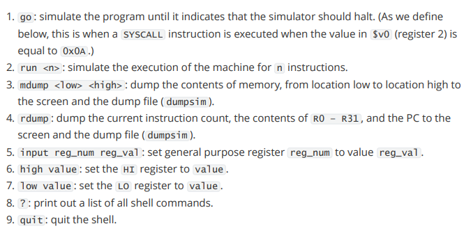
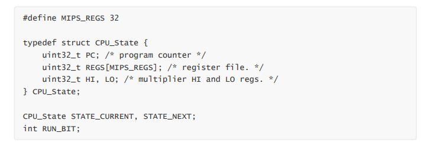
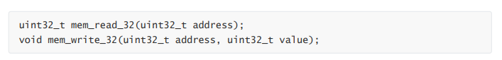
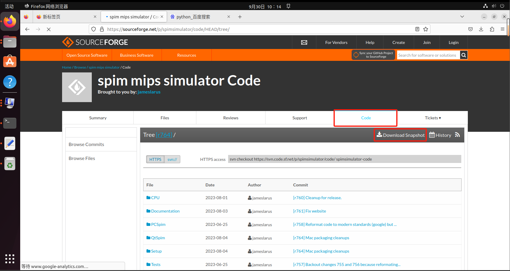
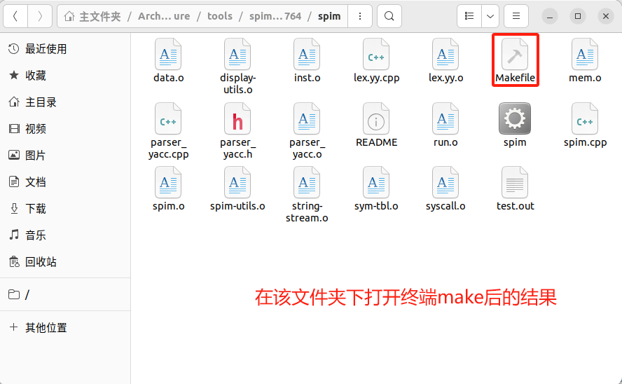
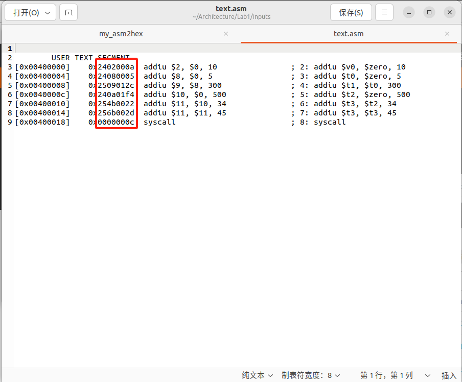
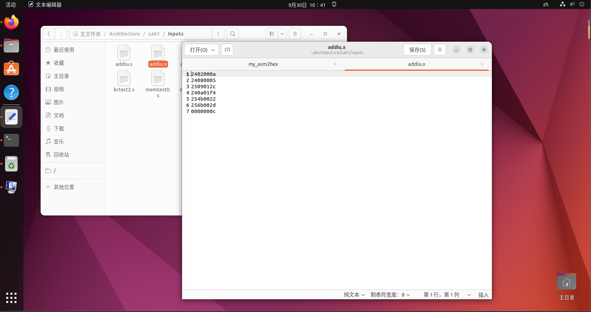
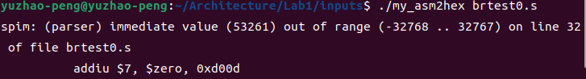

# Lab1

## 一、实验简述

在本次实验中我们将通过编写一个C语言程序实现 MIPS 指令集有限子集的指令级功能模拟器，用于模拟每条指令的行为。这个模拟器能够运行 MIPS 程序并输出结果，在后续实验中将以此为参考，验证后续实验代码是否正确执行。

**实验任务**	实现模拟例程

### （一）文件说明

#### 1."src/"子目录

- shell："shell.h",  "shell.c" (无需修改)
- simulator："sim.c" (修改)

#### 2."inputs/" 子目录

- 模拟测试输入文件："*.s"文件【MIPS汇编代码】

  每个输入文件中包含一行 MIPS 汇编指令

- MIPS 汇编程序/十六进制转存（汇编代码$\to$机器代码$\to$十六进制转存）： "asm2hex"

### （二）流程简述

- 修改"sim.c"，以执行实验室讲义中指定的 MIPS 指令集。
  讲义中指定的 MIPS 指令集。运行 "make "编译模拟器。

```shell
$ cd src/
$ make
```

得到"sim"可执行文件。

- 利用"asm2hex"将测试输入文件（"\*.s"）转换为机器代码文件（"*.x"）

```shell
$ cd inputs/
$ ./asm2hex *.s
```

- 在模拟器中运行机器码文件

```shell
$ src/sim inputs/*.x
```

## 二、相关信息

> FROM lab s1.pdf

### （一）The Shell

shell支持以下指令：



### （二）The Simulation Routine

模拟例程对输入的 MIPS 程序进行指令级模拟。在指令执行过程中，模拟器应根据 MIPSISA.pdf 中提供的 MIPS R4000 用户手册（仅限 32 位模式）中的指令 ISA 说明，获取当前的架构状态并对其进行修改。架构状态包括 PC、通用寄存器和内存映像。这些状态包含在以下全局变量中： 



此外，模拟器还对模拟系统的内存进行建模。您需要使用我们提供的以下两个函数来访问模拟内存： 



请注意，在 MIPS 中，内存是字节寻址的。此外，我们将采用小端序。这意味着机器字（32 位）的最小有效字节存储在最低地址，最大有效字节存储在最高地址。要实现 16 位和 8 位值的加载和存储，需要使用这些 32 位内存访问原语（提示：确保只修改 32 位字的适当部分！）。
特别要注意的是，在调用 `mem_read_32` 和 `mem_write_32` 时，只能使用 32 位对齐地址（即地址的底部两位应为 0）。
我们提供的模拟器骨架在 sim.c 文件中包含了一个名为 `process_instruction()` 的空函数。shell 调用该函数来模拟一条机器指令。您必须为 `process_instruction()` 编写代码，以模拟指令的执行。您还可以编写其他函数，使仿真模块化。我们建议您花些时间使代码易于阅读和理解。

## 三、实验任务

在 sim.c 中实现 `process_instruction()` 函数。`process_instruction()` 函数应能模拟以下 MIPS 指令的指令级执行：

| J      | JAL    | BEQ  | BNE   | BLEZ    | BGTZ |
| ------ | ------ | ---- | ----- | ------- | ---- |
| ADDI   | ADDIU  | SLTI | SLTIU | ANDI    | ORI  |
| XORI   | LUI    | LB   | LH    | LW      | LBU  |
| LHU    | SB     | SH   | SW    | BLTZ    | BGEZ |
| BLTZAL | BGEZAL | SLL  | SRL   | SRA     | SLLV |
| SRLV   | SRAV   | JR   | JALR  | ADD     | ADDU |
| SUB    | SUBU   | AND  | OR    | XOR     | NOR  |
| SLT    | SLTU   | MULT | MFHI  | MFLO    | MTHI |
| MTLO   | MULTU  | DIV  | DIVU  | SYSCALL |      |

请注意，对于 SYSCALL 指令，您只需实现以下行为：如果执行 SYSCALL 指令时寄存器 \$v0（寄存器 2）的值为 0x0A（十进制 10），则 go 指令应停止模拟循环并返回模拟器 shell 提示。如果 $v0 的值为其他值，指令将不起作用。两种情况下都不会修改寄存器，只是 PC 会像往常一样递增到下一条指令。您编写的 `process_instruction()` 函数应通过将全局变量 RUN_BIT 设置为 0 来终止主模拟循环。
模拟器的准确性是您的首要任务。具体来说，要确保在每条指令执行后都能正确更新架构状态。我们将使用许多输入程序（有些程序随讲义提供，有些则没有）测试您的模拟器，以确保正确模拟每条指令。
为了测试你的模拟器是否正常工作，你应该运行我们提供的输入程序，同时使用上表中列出的所有必要 MIPS 指令编写一个或多个程序，并每次执行一条指令（运行 1）。你可以使用 rdump 命令来验证机器的状态是否在每条指令执行后正确更新。
虽然表中看似有很多指令，但实际上只有几条独特的指令行为，并有一些细微的变化。您应该分组处理这些指令： R 型 ALU、I 型 ALU、LW、SW、跳转、分支等。MIPS R4000 用户手册》（在压缩包中提供）包含本表中每条指令的官方定义（SYSCALL 除外，我们在上文提供了限制性定义）。请仅执行这些指令的 32 位行为（R4000 也有 64 位模式，但在本实验和后续实验中我们可以忽略该模式）。
不过，与手册不同的是，我们将在没有 "分支延迟槽 "的情况下实现我们的架构。我们将在课堂上详细讨论分支延迟槽。就实验 s1 而言，这意味着分支指令可以在执行分支时直接更新 NEXT_STATE.PC 到分支目标。此外，"跳转连接 "指令（JAL、JALR、BLTZAL、BGEZAL）在 R31 中存储 PC + 4，而不是手册中在这些指令描述中指定的 PC + 8。在本实验中，您不需要处理某些算术指令（如 ADDI）可能引发的溢出异常。
最后请注意，您的模拟器无需处理上表中未包含的指令或任何其他无效指令。我们只会用使用上述指令的有效代码来测试你的模拟器。

## 四、实验思路

### （一）生成.x文件

根据第一节第二部分的“流程简述”内容我们可以知道，我们首先需要使用"inputs/"子目录下的脚本"asm2hex"将 MIPS 汇编代码（.s文件）转换为机器指令存入.x文件，打开脚本文件我们可以看到

```python
#!/usr/bin/python
# 导入Python的标准库模块，包括'os'(用于文件和目录操作)、'argparse'(用于解析命令行参数)和'subprcoess'(用于运行子进程)
import os, argparse, subprocess

# parse arguments
# 解析命令行参数，'argparse'模块创建了一个命令行参数解析器，参数`fasm`存储输入文件路径
parser = argparse.ArgumentParser()
parser.add_argument("fasm", metavar="input.s", help="the MIPS assembly file (ASCII)")
args = parser.parse_args()

fasm = args.fasm
fhex = os.path.splitext(args.fasm)[0] + ".x"  # 构建输出文件路径

# run SPIM (the actual MIPS assembler)
SPIM = "/afs/ece/class/ece447/bin/spim447"  # 这里使用的是 mips 模拟器 spim，改为自己的路径
cmd = [SPIM, "-notrap", "-vasm", fasm, fhex]
subprocess.call(cmd)

# SPIM outputs many files; but we are interested in only one
cmd = ["mv", fhex + ".text.dat", fhex]
subprocess.call(cmd)

# remove unnecessary two lines from the file
lines = open(fhex).readlines()
lines = map(lambda x: x.lstrip(), lines)
data = str.join('', lines[2:])
data = str.join('\n', data.split())
open(fhex, 'w').write(data)

# remove all other files
cmd = ["rm", fhex + ".*.dat"]
cmd = str.join(' ', cmd)
subprocess.call(cmd, shell=True)  # we need a shell to expand the wildcard
```

也就是说我们需要一个 spim 模拟器，参考链接：[SPIM MIPS Simulator (wisc.edu)](https://pages.cs.wisc.edu/~larus/spim.html#installing)

> QTSPIM 和 SPIM 都是 MIPS 汇编语言的模拟器，用于学习和调试 MIPS 架构的汇编代码。
>
> 1. **SPIM（MIPS Simulator）**：
>    - SPIM 是一个经典的 MIPS 汇编模拟器，最早由 James R. Larus 开发。
>    - 它提供了一个用于运行 MIPS 汇编代码的环境，包括单步执行、寄存器查看、内存查看等功能。
>    - SPIM 可用于教育和学术研究，帮助学生理解 MIPS 汇编语言和计算机体系结构。
>    - SPIM 是一个命令行工具，通常使用命令行参数来加载和运行 MIPS 汇编文件。
>
> 2. **QTSPIM**：
>    - QTSPIM 是 SPIM 的一个改进版本，它使用 Qt 框架来提供图形用户界面（GUI）。
>    - QTSPIM 保留了 SPIM 的所有功能，但添加了用户友好的界面，包括代码编辑器、调试器、内存和寄存器显示等。
>    - 这使得 QTSPIM 更容易使用，特别是对于那些不熟悉命令行界面的学生和初学者来说。
>    - QTSPIM 是跨平台的，可以在多个操作系统上运行，包括 Windows、Linux 和 macOS。
>
> 使用 SPIM 或 QTSPIM，你可以编写、汇编和执行 MIPS 汇编代码，了解和测试 MIPS 架构的程序行为。这对于学习计算机体系结构、操作系统开发和嵌入式系统编程非常有用。你可以使用这些工具来验证你的汇编代码是否按预期工作，以及在调试过程中查看寄存器和内存状态。
>
> 总的来说，SPIM 是一个经典的 MIPS 汇编模拟器，而 QTSPIM 是它的现代化版本，提供了更友好的图形用户界面，便于教育和学术用途。

我们在下载最新的SPIM之后会发现最新版的更名为QTSPIM（后来发现似乎不是这样的），下载该文件，同时其脚本也需要做出相应的变化。经过各种尝试（一天啊！一天！还是中秋节！！！）发现QTSPIM作为可视化的 MIPS 模拟器虽然具有极其强大的功能但是它并不能通过命令行操作保存输出文件，而是会调用图形化界面来显示（第一次这么讨厌图形化！）本就不怎么熟悉命令行和QTSPIM的我不断修改脚本尝试无果后，再次进入链接发现了在code界面里的文件夹SPIM，于是将源码整体打包后解压，在SPIM文件夹下打开终端并make，可以得到spim可执行程序。





```shell
sudo make install
```

将可执行文件复制到`/usr/bin`目录下。

上面给出的脚本依然无法使用，在不断修改后得到如下的可执行脚本：

```python
#!/usr/bin/python3

import os
import argparse
import subprocess

# parse arguments
parser = argparse.ArgumentParser()
parser.add_argument("fasm", metavar="input.s", help="the MIPS assembly file (ASCII)")
args = parser.parse_args()

fasm = args.fasm
fhex = os.path.splitext(args.fasm)[0] + ".x"  # 构建输出文件路径

# 提供QtSPIM的可执行文件路径
SPIM = "/home/yuzhao-peng/Architecture/tools/spimsimulator-code-r764/spim/spim"

cmd = [SPIM, "-notrap", "-file", fasm, "-dump", "text.asm"]
subprocess.call(cmd)

# 从文本文件中提取并保存机器代码
with open("text.asm", "r") as asm_file:
    lines = asm_file.readlines()
    hex_data = []
    for line in lines:
        parts = line.split()
        if len(parts) >= 2 and parts[1].startswith("0x"):
            hex_data.append(parts[1][2:])

# 将提取的数据保存到 fhex 文件中
with open(fhex, "w") as hex_file:
    hex_file.write("\n".join(hex_data))

# 删除临时生成的文件
os.remove("text.asm")
os.remove("data.asm")
```

在这里我这个脚本最后的部分稍作说明：

我们通过脚本在执行完 spim 的命令行调用之后会得到两个文件分别是text.asm和data.asm，即代码段和数据段的内容输出文件，我们可以打开text.asm文件观察其格式如下：

我们真正所需要的是红色方框内部的机器代码，因此我们利用python语言的特性按行遍历读取文本，通过`if len(parts) >= 2 and parts[1].startswith("0x")`筛选出机器代码并存入列表，最终将列表转存为.x文件，然后删除多余的无用文件。

执行`./my_asm2hex addui.s`再次查看输出文件如下所示：



目的达成~【太艰难了@。#】

好吧，高兴的太早了，事实证明我只实现了addiu.s、arithtest.s、memtest0.s三个文件的正常转换，剩下的文件中虽然也生成了相应的机器代码但并不完整，出现了立即数超限的问题，如下所示：



我采用另外一种方式来实现相同的功能，我们可以通过以下命令行指令实现将.s文件转换为目标.x文件：

```shell
mips-linux-gnu-as -march=mips32 -o addiu.o addiu.s
mips-linux-gnu-objcopy -O binary -j .text addiu.o addiu.bin
xxd -p -c 4 addiu.bin > addiu.x
```

但是我们发现这样生成的.x文件最后会多出来一行0，而这一行是我们不想要的东西，于是我想到了继续完善脚本，利用python的相关功能去删除这一行0。由于前面的尝试太痛苦，所以我不忍心直接推到重来，于是在原来的脚本上继续缝缝补补，那么现在就需要重点考虑什么时候采用这第二种方法，经过查阅资料最终生成了最终版的脚本文件`my_asm2hex`。（忽然明白为什么很多软件都是越来越复杂，明明可以简化的东西，看来和我一样无法舍弃历史包袱啊【给自己脸上贴金】；本来应该把每一版的代码都上传，但是因为离ddl太近，所以我只上传了最终完成版，以后一定会注意！！！）

好吧，这个方法还是不能完全解决，我回到最初的版本，起码是统一的文件。

**那么实验的第一步——通过修改脚本并执行使得.s文件中的 mips 汇编指令生成机器指令并存储到.x文件	**==成功==

### （二）编写sim.c程序

### （三）执行测试